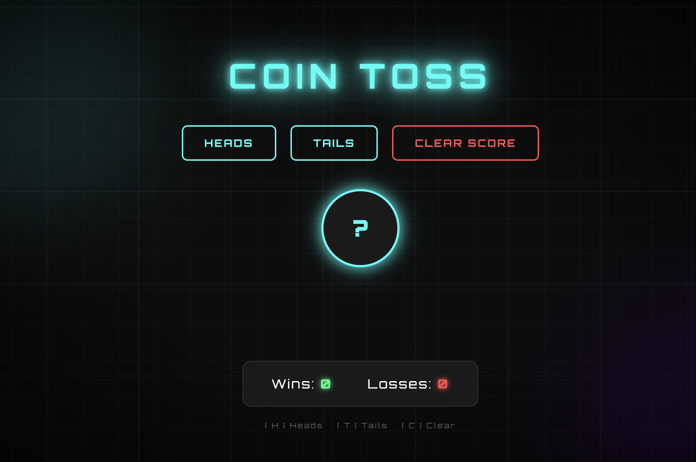

# 🪙 coin toss

a neon-styled coin toss game built with vanilla html, css, and javascript.
pick heads or tails, watch the coin flip, and track your score.

&nbsp;

&nbsp;

---

✦ preview

---

✦ features

- 🪙 animated coin flip on every guess
- 🔥 win streak counter for consecutive wins
- 💾 persistent scoreboard using localStorage
- ⌨️ keyboard shortcuts — [ H ] Heads  [ T ] Tails  [ C ] Clear
- 🌌 neon dark theme with animated background

---

✦ built with

- HTML5 / CSS3 / JavaScript
- Google Fonts — Orbitron
- localStorage API
